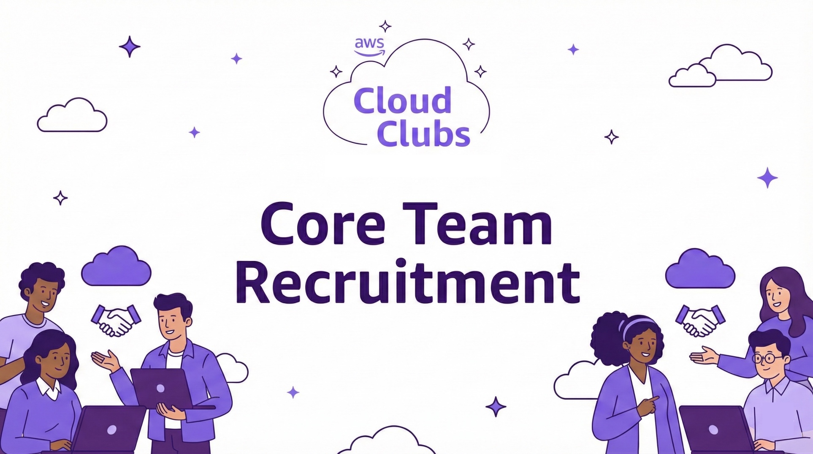

<p align="center">
  
</p>

<h1 align="center">☁️ Cloud Club — Core Team Recruitment Template</h1>

<p align="center">
  A free, open-source, multi-step recruitment form template — no Google Forms, no third-party form builders, no backend.<br/>
  Just share the link in your group, collect applications, and get responses straight in Google Sheets.
</p>

<p align="center">
  
  
  
  
</p>

<p align="center">
  🔗 <a href="https://technicalmonish.github.io/AWS-Core-Team-Recruitment-Form/"><strong>Live Demo →</strong></a>
</p>

---

## 👀 Preview

<p align="center">
  
</p>
<p align="center"><em>Full page overview of the recruitment form</em></p>

**Step 1** — Personal details (name, email, phone, branch, section, year)

<p align="center"></p>

**Step 2** — Essay questions (why join, improvements, expectations)

<p align="center"></p>

**Step 3** — Skills & expertise (checkboxes, proof links)

<p align="center"></p>

**Step 4** — Workshop availability & acknowledgment

<p align="center"></p>

**Step 5** — Success page with confetti & WhatsApp group link

<p align="center"></p>

> Drop `pre.png`, `1.png` – `5.png` into the repo root for these to render.

---

## ✨ Features

- 🧩 **4-Step Form** — Clean, guided multi-page flow with progress indicator
- ☁️ **Animated Clouds & Confetti** — Smooth CSS/JS animations for a polished feel
- 📱 **Fully Responsive** — Works on desktop, tablet, and mobile
- ✅ **Client-Side Validation** — Required fields, email & phone format checks
- 📊 **Google Sheets Integration** — Zero-cost, serverless data collection
- 💬 **WhatsApp Group Link** — Post-submission CTA to keep applicants in the loop
- 🆓 **100% Free** — No subscriptions, no third-party form tools, no hidden costs
- **Just Share the Link** — Host it anywhere (GitHub Pages, Netlify, Vercel) and share in your groups

---

## 📁 Project Structure

```
├── index.html      # Multi-step form markup
├── styles.css      # All styling, animations, and responsive rules
├── script.js       # Navigation, validation, confetti, and Sheets submission
├── banner.png      # Your club/org logo (replace with your own)
└── README.md
```

---

## 🚀 Quick Setup (3 Placeholders)

After cloning, you only need to replace **3 placeholders** to make this your own:

| Placeholder               | File         | What to Replace With                       |
| ------------------------- | ------------ | ------------------------------------------ |
| `YOUR_LOGO_PATH`          | `index.html` | Path to your logo file (e.g. `banner.png`) |
| `YOUR_GOOGLE_SHEET_URL`   | `script.js`  | Your Google Apps Script Web App URL        |
| `YOUR_WHATSAPP_GROUP_URL` | `index.html` | Your WhatsApp group invite link            |

---

## 🖼️ 1. Add Your Logo

1. Drop your logo image into the project folder (e.g. `banner.png`).
2. Open `index.html` and find:
   ```html
   
   ```
3. Replace `YOUR_LOGO_PATH` with your file name:
   ```html
   
   ```

---

## 💬 2. Add Your WhatsApp Group Link

1. Open your WhatsApp group → **Group Info → Invite via link → Copy link**.
2. Open `index.html` and find the success page section:
   ```html
   <a href="YOUR_WHATSAPP_GROUP_URL" target="_blank" ...></a>
   ```
3. Replace `YOUR_WHATSAPP_GROUP_URL` with your invite link:
   ```html
   <a href="https://chat.whatsapp.com/YOUR_GROUP_ID" target="_blank" ...></a>
   ```

---

## 📊 3. Connect Your Google Sheet

Completely free, no server required.

### 3a. Create a Google Sheet

- Go to [sheets.google.com](https://sheets.google.com) and create a new spreadsheet.
- Add these headers in **Row 1**:

| A         | B          | C         | D     | E     | F      | G       | H    | I        | J            | K            | L      | M           | N          | O        |
| --------- | ---------- | --------- | ----- | ----- | ------ | ------- | ---- | -------- | ------------ | ------------ | ------ | ----------- | ---------- | -------- |
| Timestamp | First Name | Last Name | Gmail | Phone | Branch | Section | Year | Why Join | Improvements | Expectations | Skills | Other Skill | Proof Link | Workshop |

### 3b. Add the Apps Script

- In your spreadsheet, go to **Extensions → Apps Script**.
- Delete any boilerplate code and paste:

```javascript
function doPost(e) {
  var sheet = SpreadsheetApp.getActiveSpreadsheet().getActiveSheet();
  var data = JSON.parse(e.postData.contents);

  sheet.appendRow([
    new Date(),
    data.firstName,
    data.lastName,
    data.gmail,
    data.phone,
    data.branch,
    data.section,
    data.year,
    data.whyJoin,
    data.improvements,
    data.expectations,
    Array.isArray(data.skills) ? data.skills.join(", ") : data.skills,
    data.otherSkill,
    data.proofLink,
    data.workshop,
  ]);

  return ContentService.createTextOutput(
    JSON.stringify({ status: "success" }),
  ).setMimeType(ContentService.MimeType.JSON);
}
```

- Click **Save** (💾).

### 3c. Deploy as a Web App

1. Click **Deploy → New deployment**
2. Click the gear icon → select **Web app**
3. Set:
   - **Execute as:** Me
   - **Who has access:** Anyone
4. Click **Deploy** and authorize when prompted
5. Copy the **Web App URL** — it looks like:
   ```
   https://script.google.com/macros/s/AKfycbx.../exec
   ```

### 3d. Paste the URL in `script.js`

Open `script.js` and find:

```javascript
const GOOGLE_SHEET_URL = "YOUR_GOOGLE_SHEET_URL";
```

Replace with your URL:

```javascript
const GOOGLE_SHEET_URL =
  "https://script.google.com/macros/s/YOUR_DEPLOYMENT_ID/exec";
```

Done — form submissions now land in your spreadsheet. 🎉

> **Tip:** If you update the Apps Script later, create a **new deployment** (or update the existing one) for changes to take effect.

---

## 🛠️ Customization

| What                                | Where                               |
| ----------------------------------- | ----------------------------------- |
| Form fields & pages                 | `index.html`                        |
| Colors, fonts, animations           | `styles.css`                        |
| Validation rules & submission logic | `script.js`                         |
| WhatsApp group link                 | `index.html` → success page section |
| Banner logo                         | `index.html` → banner section       |

---

## 📝 License

This project is open source and available under the [MIT License](LICENSE).

---

## 🙌 Credits

Created and open-sourced by **[Technical Monish](https://github.com/technicalmonish)** to make recruitment forms accessible to everyone — no more depending on Google Forms or paid form builders. Fork it, customize it, share it in your groups, and start collecting applications for free.

If this template helped you, consider giving it a ⭐ on GitHub.

---

<p align="center">
  Made with ☁️ by <a href="https://github.com/technicalmonish">Technical Monish</a>
</p>
